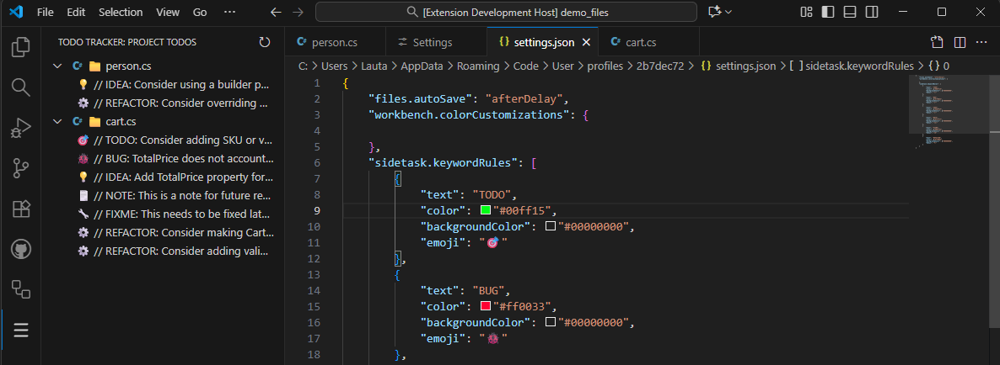

# SideTask - All in one smart TODO Manager

  
   
  <strong>Your entire codebase's TODO list, in one place.</strong>

  
  
  
  <!-- 
  
  -->

**SideTask** is a powerful VS Code extension that finds all the TODOs, FIXMEs, and other task comments scattered across your project and brings them into one organized view in your activity bar.

Stop losing track of pending tasks and technical debt. If it's in your code, it's on your list.

## Table of Contents
- [New features](#NEW)
- [Already implemented](#Already-implemented)
- [Getting started](#getting-started)
- [Configure the colors and the icons](#how-can-i-add-my-word-configure-the-colors-and-the-icons)
- [Configure the option to ignore files or folders](#how-can-i-ignore-a-files-or-folders)
- [Roadmap](#whats-next-roadmap)
- [Support](#Support-the-Project)
- [Licence](#license)

## Features (v1.1.0) 🎆

### NEW
- **Automatic Refresh:** The TODOs view now refreshes automatically when the branch is changed.

### Already implemented
- **Ignore files:** Added a feature to ignore specific routes and files.
- **Number of items:** A feature was added that counts the number of items according to the grouping.
  
  
* **✨ Custom Highlighting:** Define your own keywords (like `NOTE`, `BUG`) and give them custom colors.
  
  
* **🎛️ Advanced Filtering:** Filter tasks by keyword.
  
  
* **🖱️ Right-Click Menu:** Context Actions: "Go to file", "Delete line", "Copy line".
  
* **💡 Icons:** Display a different icon for each keyword type:
  * 🎯 TODO
  * 🐞 BUG
  * 💡 IDEA
  * 🗒️ NOTE
  * 🔧 FIXME
  * ⚙️ REFACTOR
  
  You can select which icon to display for each keyword!
  

* **🌲 Unified Tree View:** See all found tasks in a clean, collapsible tree view, neatly organized by file.
* **⌨️ Default Keywords:** Automatically scans your project for `TODO:`, `BUG:`, `IDEA:`, `NOTE:`, `FIXME:` and `REFACTOR:`.
* **🖱️ Click-to-Go:** Instantly jump to the exact line of any task in your code just by clicking on it in the side panel.
* **🔄 Manual Refresh:** A simple "Refresh" button in the view's title bar to re-scan your workspace at any time.
* **🔄 Automatic Refresh:** The extension will re-scan your workspace each time you save a file (ctrl+s).
* **⌨️ Your oun Keywords:** Automatically scan your project for any word you choose.

## Getting Started
1. Install the **SideTask** extension from the VS Code Marketplace.
2. Open a project.
3. Click on the new **SideTask icon** in your Activity Bar (the sidebar on the left).
4. The panel will automatically populate with all the tasks found in your code.
5. Click any task to jump straight to the file!

## How can I add my word, configure the colors and the icons?
1. Go to Settings (File -> Preferences -> Settings or keyboard shortcut `Ctrl + ,`).
2. Search "SideTask".
3. Go to the option SideTask: Keywords Rules.
4. Click the button "Edit in settings.json".
  
5. A JSON file will open.
  
6. In this file, you can choose the font color background color, and which emoji will be associated with the keyword. It's recommended that you use the keyboard shortcut `Win + .` to select an icon.

## How can I ignore a files or folders?
1. Go to Settings (File -> Preferences -> Settings or keyboard shortcut `Ctrl + ,`).
2. Search "SideTask".
3. Go to the option SideTask: Ignore.
  
4. Add the file or folder you want to ignore using the following format:
    - File: `**/filename.cs`
    - Folder: `**/foldername/**`

Note: By default, SideTask ignores the following paths: 
`**/node_modules/**`,`**/dist/**`,`**/out/**"`, `**/.git/**`, `**/.DS_Store/**`, `**/bin/**`, `**/obj/**`.

## What's Next? (Roadmap)
SideTask is just getting started. Our goal is to make this the *ultimate* task management tool for developers, right inside the editor. Here is what's planned:

* **⚡ Smart Snippets:** Quickly create new TODO items with snippets. Type TODO and press Tab autocomplete // TODO: [ ].
* **⚡ Keyboard shortcuts:** Quickly create new TODO items with keyboard shortcuts.
* **Enriched Syntax:** The extension learns to "read" the contents of the TODO. The parser recognizes special patterns:
  - **Tags:** `// TODO: Fix this #bug #ui`.
  - **Dates:** `// REFACTOR: Clean this @due:2025-12-01`.
  - **Status:** `// TODO: Implement function @done`  vs `// TODO: Implement function @pending`.
* **Markdown Support (`.todo`):** Allows you to manage tasks in dedicated `.md` or `.todo` files. It recognizes Markdown task syntax and adds them to the tree view.
* **Right-Click Menu:** Context Actions: Add the option "Edit line".
* **🚀 [PRO] Integrations:** Connect SideTask to your favorite tools like **Notion**, **Jira**, and **Trello** to turn code comments into a card.
* **🚀 [PRO] AI Integrations:** Connect SideTask to your favorite AI like **Chat GPT**.

## Support the Project
This is an indie project built with ❤️. If you find SideTask useful, please consider supporting its development:

* Leave a ⭐️⭐️⭐️⭐️⭐️ rating on the [Marketplace](https://marketplace.visualstudio.com/items?itemName=LautaroRojas.sidetask).
* Report bugs or request features on our [GitHub Issues](https://github.com/lautaro-rojas/SideTask/issues).
* [Buy me a coffee!](https://buymeacoffee.com/lautarorojas) 

## License

This extension is licensed under the [MIT License](LICENSE.md).
