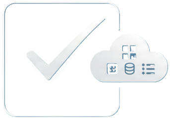

# SideTask - All in one smart TODO Manager

  
   
  <strong>Your entire codebase's TODO list, in one place.</strong>

  
  

**SideTask** is a powerful VS Code extension that finds all the TODOs, FIXMEs, and other task comments scattered across your project and brings them into one organized view in your activity bar.

Stop losing track of pending tasks and technical debt. If it's in your code, it's on your list.

---

## Features (MVP v0.1.0)

This is the first release of SideTask, focusing on the essential features to get you organized:

* **🌲 Unified Tree View:** See all found tasks in a clean, collapsible tree view, neatly organized by file.
* **⌨️ Default Keywords:** Automatically scans your project for `TODO:`, `FIXME:`, and `HACK:`.
* **🖱️ Click-to-Go:** Instantly jump to the exact line of any task in your code just by clicking on it in the side panel.
* **🔄 Manual Refresh:** A simple "Refresh" button in the view's title bar to re-scan your workspace at any time.

<!--

*(Te recomiendo 100% que grabes un GIF corto mostrando la extensión en acción y reemplaces esta línea)*
-->

## Getting Started

1.  Install the **SideTask** extension from the VS Code Marketplace.
2.  Open a project.
3.  Click on the new **SideTask icon** in your Activity Bar (the sidebar on the left).
4.  The panel will automatically populate with all the tasks found in your code.
5.  Click any task to jump straight to the file!

## What's Next? (Roadmap)

SideTask is just getting started. Our goal is to make this the *ultimate* task management tool for developers, right inside the editor. Here is what's planned:

* **✨ Custom Highlighting:** Define your own keywords (like `NOTE:`, `BUG:`) and give them custom colors.
* **🎛️ Advanced Filtering:** Filter tasks by keyword, tag, or file.
* **⚡ Smart Snippets:** Quickly create new TODO items with keyboard shortcuts.
* **🚀 [PRO] Integrations:** Connect SideTask to your favorite tools like **Notion**, **Jira**, and **Trello** to turn code comments into real tasks.

## Support the Project

This is an indie project built with ❤️. If you find SideTask useful, please consider supporting its development:

* Leave a ⭐️⭐️⭐️⭐️⭐️ rating on the [Marketplace](https://marketplace.visualstudio.com/items?itemName=LautaroRojas.sidetask).
* Report bugs or request features on our [GitHub Issues](https://github.com/tu-usuario/sidetask/issues).
* [Buy me a coffee!](https://buymeacoffee.com/lautarorojas) 

## License

This extension is licensed under the [MIT License](LICENSE.md).